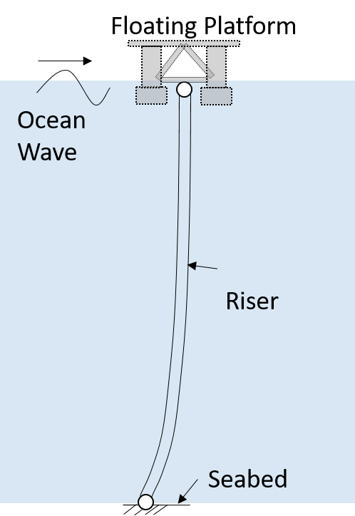
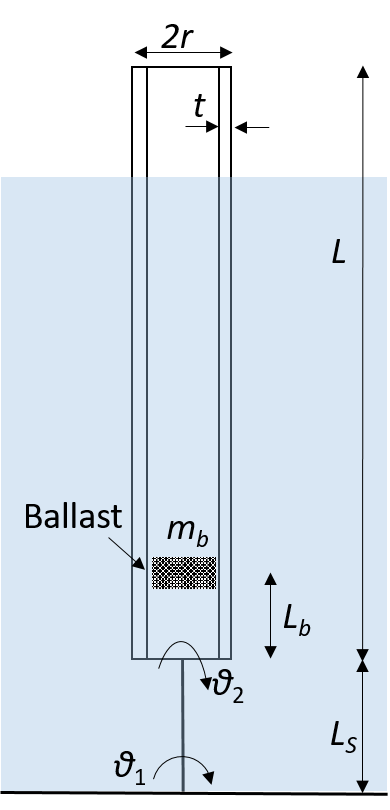

# Probabilistic-sensitivity-framework
A general framework for probabilistic sensitivity analysis with respect to distribution parameters

# 1. The sensitivity framework 

Probabilistic sensitivity analysis identifies the influential uncertain input to guide decision-makings. We propose a general sensitivity framework with respect to input distribution parameters that unifies a wide range of sensitivity measures, including information theoretical metrics such as the Fisher information. The framework is derived analytically via a constrained maximization and the sensitivity analysis is reformulated into an eigenvalue problem. There are only two main steps to implement the sensitivity framework utilising the likelihood ratio/score function method, a Monte Carlo type sampling followed by solving an eigenvalue equation. The resulted eigenvectors then provide the directions for simultaneous variations of the input parameters and guide the focus to perturb uncertainty the most. Not only is it conceptually simple, numerical examples demonstrate that the proposed framework also provide new sensitivity insights, such as the combined sensitivity of multiple correlated uncertainty metrics, robust sensitivity analysis with a entropic constraint and approximation of deterministic sensitivities. 

The core equation for this framework is this simple eigenvalue equation:
$$\mathbb E \left[ \mathbf{rr}^{\mathsf{T}} \right] \mathbf {q} = \lambda \mathbf {q}$$
where the $jk^{\text{th}}$ entry of the matrix $\mathbf r$ is defined as: $r_{jk}  =  \frac{1}{U_k} \frac {\partial U_k}{\partial b_j}$

The matrix $\bf r$ can be seen as a counterpart of the deterministic sensitivity matrix (Jacobian matrix). The 2nd moment of the sensitivity matrix, $\mathbb E \left[ \mathbf{rr}^{\mathsf{T}} \right]$, arises naturally from a perturbation analysis. As it is in the form of a Gram matrix, $\mathbb E \left[ \mathbf{rr}^{\mathsf{T}} \right]$ is symmetric positive semi-definite. 

The utility function $U$ represents a wide range of metrics, including the moment function of a random output, the failure probability and the density function. Furthermore, the Fisher information matrix can be found as a special case of the proposed sensitivity metric. 

# 2. Demonstration examples 

To implement the numerical case studies, you need to download the sensitivity code of [TEDS](/../../../../longitude-jyang/TEDS-ToolboxEngineeringDesignSensitivity) from a different repository. The three cases studies call TEDS for the sensitivity analysis. The functions for the three cases are [call_caseNo1.m](/code/call_caseNo1.m) etc
  
## 2.1 Case-1 

Case-1 considers a simple flexible cantilever beam that is subject to a whie noise excitation 

## 2.2 Case-2 

Case-2 considers a flexible marine riser that is subject to a random wave excitation 

## 2.3 Case-3 

Case-3 considers a rigid body floaitng column in a wave tank 

